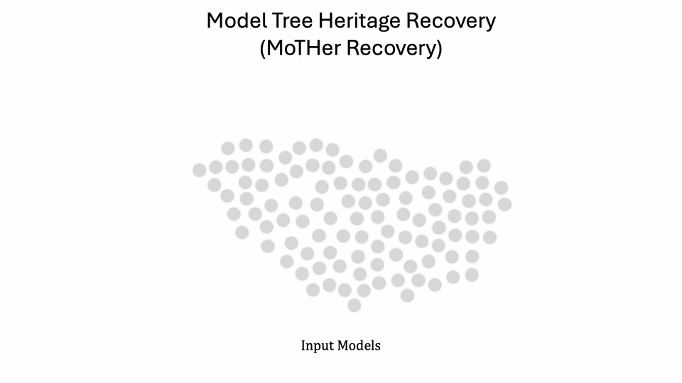

# Model Tree Heritage Recovery
Official PyTorch Implementation for the "Model Tree Heritage Recovery" paper.  
<p align="center">
    🌐 <a href="https://vision.huji.ac.il/mother/" target="_blank">Project</a> | 📃 <a href="https://arxiv.org/abs/TODO" target="_blank">Paper</a><br>
</p>



Our proposed *Model Graphs* and *Model Trees* are new data structures for describing the heredity training relations between models.
In these structures, heredity relations are represented as directed edges. 
We introduce the task of *Model Tree Heritage Recovery* (MoTHer Recovery), its goal is to uncover the 
unknown structure of Model Graphs based on the weights of a set of input models.
___

> **Model Tree Heritage Recovery**<br>
> Eliahu Horwitz, Asaf Shul, Yedid Hoshen<br>
> <a href="https://arxiv.org/abs/2405.18432" target="_blank">https://arxiv.org/abs/2405.18432 <br>
>
>**Abstract:** The rapid growth of neural network models shared on the internet has made model weights
> an important data modality. However, this information is underutilized as the weights are uninterpretable, 
> and publicly available models are disorganized. Inspired by Darwin's tree of life, we define the *Model Tree* 
> which describes the origin of models i.e., the parent model that was used to fine-tune the target model. 
> Similarly to the natural world, the tree structure is unknown. In this paper, we introduce the task of 
> *Model Tree Heritage Recovery* (MoTHer Recovery) for discovering Model Trees in the ever-growing universe of 
> neural networks. Our hypothesis is that model weights encode this information, the challenge is to decode the 
> underlying tree structure given the weights. Beyond the immediate application of model authorship attribution, 
> MoTHer recovery holds exciting long-term applications akin to indexing the internet by search engines. 
> Practically, for each pair of models, this task requires: i) determining if they are related, and ii) establishing the 
> direction of the relationship. We find that certain distributional properties of the weights evolve monotonically during training, 
> which enables us to classify the relationship between two given models. MoTHer recovery reconstructs entire model hierarchies, 
> represented by a directed tree, where a parent model gives rise to multiple child models through additional training. 
> Our approach successfully reconstructs complex Model Trees, as well as the structure of "in-the-wild" model 
> families such as Llama 2 and Stable Diffusion.

## Installation 
1.  Clone the repo:
```bash
git clone https://github.com/eliahuhorwitz/MoTHer.git
cd MoTHer
```
2. Create a new environment and install the libraries:
```bash
python3 -m venv mother_venv
source mother_venv/bin/activate
pip install -r requirements.txt
```


## The VTHR Dataset 
The ViT Tree Heritage Recovery (VTHR) dataset is a dataset that was created for the purpose of evaluating the MoTHer Recovery task. 
The dataset contains three splits: i) FT - Fully fine-tuned models, ii) LoRA-V - ViT models that were fine-tuned with LoRA with varying ranks, 
and iii) LoRA-F - ViT models that were fine-tuned with LoRA of rank 16. 

Each split contains a Model Graph with 105 models in 3 levels of hierarchy and with 5 Model Trees. 
All the models for the VTHR dataset are hosted on Hugging Face under the [https://huggingface.co/MoTHer-VTHR](https://huggingface.co/MoTHer-VTHR) organization.
To easily process all the models of a Model Graph, we provide a pickle file per script that contains the 
original tree structure and the paths for each model. The pickle files are located in the `dataset` directory.

Each of the splits is roughly 30GB in size, there is **no need** to download the dataset in advance, the code will take care of this for you.

## Running MoTHer on the VTHR Dataset 
Below are instructions to run MoTHer Recovery on the different splits. 
We start by assuming the models are already clustered into the different Model Trees. 
We will later discuss how to perform this clustering.

### Running on Model Graphs with known model clusters

#### Running on the FT Split
As a first step we need to gather the weight statistics, this is done by running the following command:
```bash
python get_vit_layer_statistics.py
```

Once the statistics are gathered, we can run the MoTHer Recovery on the FT split:
```bash
python MoTHer_FullFT.py
```

#### Running on the LoRA Splits
For the LoRA-V and LoRA-F splits, there is no need to gather the weight statistics, we can directly run the MoTHer Recovery:
```bash
python MoTHer_LoRA.py
```


### Running on Model Graphs with multiple Model Trees 
When running on models from different Model Trees (i.e., a Model Graph), running the clustering is needed.
We provide a script that shows the clustering accuracy for both the LoRA-V and the FT splits.
You can change the 'LORA' flag to switch between the two splits.

```bash
python clustering.py  
```


## Running MoTHer on in-the-wild Models
For Running MoTHer on Llama2 or Stable Diffusion you can run the tests in the `test_llama_and_sd.py` file.
for llama2 run the `test_llama()` test and for Stable Diffusion run the `test_SD()` test.


## Citation
If you find this useful for your research, please use the following.

```
@misc{2405.18432,
Author = {Eliahu Horwitz and Asaf Shul and Yedid Hoshen},
Title = {On the Origin of Llamas: Model Tree Heritage Recovery},
Year = {2024},
Eprint = {arXiv:2405.18432},
}
```


## Acknowledgments
- The project makes extensive use of the different Hugging Face libraries (e.g. [Diffusers](https://huggingface.co/docs/diffusers/en/index), [PEFT](https://huggingface.co/docs/peft/en/index), [Transformers](https://huggingface.co/docs/transformers/en/index)).
